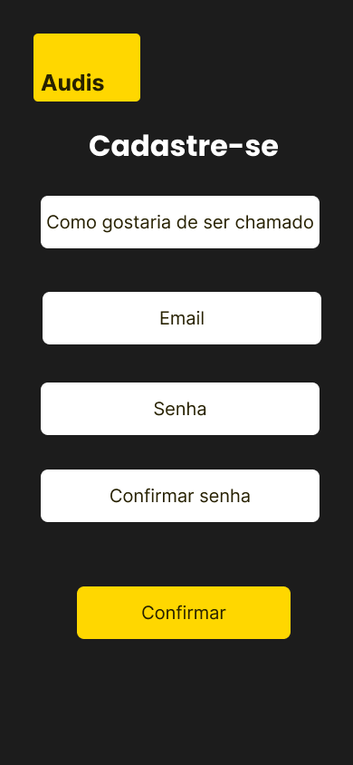

# Plataforma de Livros em Kotlin

Este é um projeto de uma plataforma de livros desenvolvida em Kotlin. A aplicação permite que os usuários se cadastrem, façam login e naveguem por uma página inicial com a listagem de livros. Este projeto visa fornecer uma interface simples e intuitiva, além de uma arquitetura bem estruturada.

## Funcionalidades

- **Login**: Permite que os usuários se autentiquem na plataforma.
- **Cadastro**: Usuários podem criar uma conta fornecendo informações básicas.
- **Página Inicial**: Exibe uma lista de livros disponíveis na plataforma.
  
## Layouts

A seguir, você pode visualizar as telas que foram criadas no Figma para o design da aplicação.

### 1. Tela de Login

A tela de login permite que os usuários insiram suas credenciais para acessar a plataforma.

### 2. Tela de Cadastro

Na tela de cadastro, os usuários podem criar uma nova conta, fornecendo nome, e-mail e senha.

### 3. Página Inicial de Livros

A página inicial exibe uma lista de livros, onde o usuário pode navegar e visualizar detalhes.

  

## Tecnologias

- Kotlin
